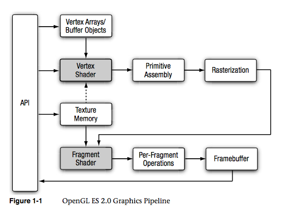
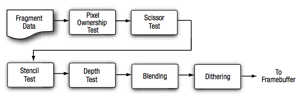

### 简介
OpenGL ES (OpenGL for Embedded Systems) 是 OpenGL 三维图形 API 的子集,针对手机、PDA和游戏主机等嵌入式设备而设计。OpenGL ES 是从 OpenGL 裁剪的定制而来的，OpenGL ES 1.x 针对固定管线硬件的，OpenGL ES 2.x 针对可编程管线硬件。OpenGL ES 2.0是Khronos Group在2007年3月份制定的一种业界标准应用程序编程接口(API)，iOS 从 3GS 以及以后开始支持 OpenGL ES 2.0 。

### 和其他版本的异同

和 1.x 版本相比：OpenGL ES 有以下特点

- 不支持固定管线(No fixed pipeline support)
- 只能用顶点数组或者顶点缓冲来处理顶点(Vertex handling only using Vertex Arrays/Vertex Buffers)
- 去除一些工具方法(Fewer helper functions)

### OpenGL ES 2.0 管线结构介绍

 

图中阴影部分 Vertex Shader 和 Fragment Shader 是可编程管线。可编程管线就是说这个操作可以动态编程实现而不必固定写死在代码中。可动态编程实现这一功能一般都是脚本提供的，在OpenGL ES 中也一样，编写这样脚本的能力是由着色语言(Shader Language)提供的。那可编程管线有什么好处呢？方便我们动态修改渲染过程，而无需重写编译代码，当然也和很多脚本语言一样，调试起来不太方便。  

 再回到上图，这张图就是 OpenGL ES 的“架构图”,学习OpenGL ES 就是学习这张图中的每一个部分. 
 
 
1. Vertex Array/Buffer objects： 顶点数据来源，这时渲染管线的顶点输入，通常使用 Buffer objects效率更好
1. 顶点着色器(Vertex Shader)
	- 输入(Inputs): Attributes (vertex position and other per-vertex attributes such as texture positions through Vertex Arrays/Vertex Buffers), Samplers (Textures), Uniforms (Constants)
	- 输出（Outputs）： gl_Position (in Clip Coordinates), gl_FrontFacing (auto-generated), gl_PointSize (for Point Sprites), user-defined Varyings (to Fragment Shader)
1. 原始装配(Primitive Assembly): 图元装配，经过着色器处理之后的顶点在图片装配阶段被装配为基本图元。OpenGL ES 支持三种基本图元：点，线和三角形，它们是可被 OpenGL ES 渲染的。接着对装配好的图元进行裁剪（clip）：保留完全在视锥体中的图元，丢弃完全不在视锥体中的图元，对一半在一半不在的图元进行裁剪；接着再对在视锥体中的图元进行剔除处理（cull）：这个过程可编码来决定是剔除正面，背面还是全部剔除。下列坐标转换在该阶段完成：
   - 剪裁（Clipping）
	- Perspective Division (results in Device Coordinates)
	- Viewport Transformation (results in Window Coordinates)
1. 光栅化(Rasterization)
	- 剔除（Culling）
	- 深度偏移（Depth Offset）
	- Varying Interpolation
1. 片元着色器(Fragment Shader)
	- Inputs: gl_FragCoord, gl_FrontFacing, gl_PointCoord, Samplers (Textures), Uniforms (Constants), interpolated Varyings (from Vertex Shader)
	- Output: gl_FragColor
1. 片元操作（Fragment Operations）
	
	- Scissor Test
	- Stencil Test
	- Depth Test
	- 混合(Blending)
	- 抖动（Dithering）
1. 帧缓冲（Framebuffer）  
 	Framebuffer objects have three attached objects: Depth, or Stencil Renderbuffer, and a Color renderbuffer or Texture Buffer. Color renderbuffers cannot be used as texture sources.
	这是流水线的最后一个阶段，Framebuffer 中存储这可以用于渲染到屏幕或纹理中的像素值，也可以从Framebuffer 中读回像素值，但不能读取其他值

### 不使用 GLKit 的Demo

首先是两个工具方法，用于从着色器文件中加载着色器

[参考代码](https://github.com/tangyumeng/OpenGLESDemo/blob/master/OpenGLESDemo/Utils/GLESUtils.m)

<pre><code>
+(GLuint)loadShader:(GLenum)type withFilepath:(NSString *)shaderFilepath
{
    NSError* error;
    NSString* shaderString = [NSString stringWithContentsOfFile:shaderFilepath 
                                                       encoding:NSUTF8StringEncoding
                                                          error:&error];
    if (!shaderString) {
        NSLog(@"Error: loading shader file: %@ %@", shaderFilepath, error.localizedDescription);
        return 0;
    }
    
    return [self loadShader:type withString:shaderString];
}

+(GLuint)loadShader:(GLenum)type withString:(NSString *)shaderString
{   
    // glCreateShader 创建空白着色器对象，并返回一个非零值，通过这个值可以引用到创建的着色器对象。
    // 一个着色器对象主要用来维护定义着色器的源代码字符串
    //参数只能是 GL_VERTEX_SHADER 、GL_FRAGMENT_SHADER (顶点着色器、片元着色器)
    GLuint shader = glCreateShader(type);
    if (shader == 0) {
        NSLog(@"Error: failed to create shader.");
        return 0;
    }
    
    // Load the shader source
    const char * shaderStringUTF8 = [shaderString UTF8String];
    glShaderSource(shader, 1, &shaderStringUTF8, NULL);
    
    // 编译存储在着色器对象中的源代码字符串
    glCompileShader(shader);
    
    // 检查编译结果，如果失败，则删除着色器对象，退出程序
    GLint compiled = 0;
    glGetShaderiv(shader, GL_COMPILE_STATUS, &compiled);
    
    if (!compiled) {
        GLint infoLen = 0;
        glGetShaderiv ( shader, GL_INFO_LOG_LENGTH, &infoLen );
        
        if (infoLen > 1) {
            char * infoLog = malloc(sizeof(char) * infoLen);
            glGetShaderInfoLog (shader, infoLen, NULL, infoLog);
            NSLog(@"Error compiling shader:\n%s\n", infoLog );            
            
            free(infoLog);
        }
        
        glDeleteShader(shader);
        return 0;
    }

    return shader;
}

+(GLuint)loadProgram:(NSString *)vertexShaderFilepath withFragmentShaderFilepath:(NSString *)fragmentShaderFilepath
{
    // Load the vertex/fragment shaders
    GLuint vertexShader = [self loadShader:GL_VERTEX_SHADER
                              withFilepath:vertexShaderFilepath];
    if (vertexShader == 0){
        glDeleteShader(vertexShader);
        return 0;
    }
    
    GLuint fragmentShader = [self loadShader:GL_FRAGMENT_SHADER
                                withFilepath:fragmentShaderFilepath];
    if (fragmentShader == 0) {
        glDeleteShader(fragmentShader);
        return 0;
    }
    
    // Create the program object
    GLuint programHandle = glCreateProgram();
    if (programHandle == 0)
        return 0;
    
    glAttachShader(programHandle, vertexShader);
    glAttachShader(programHandle, fragmentShader);
    
    // Link the program
    glLinkProgram(programHandle);
    
    // Check the link status
    GLint linked;
    glGetProgramiv(programHandle, GL_LINK_STATUS, &linked);
    
    if (!linked) {
        GLint infoLen = 0;
        glGetProgramiv(programHandle, GL_INFO_LOG_LENGTH, &infoLen);
        
        if (infoLen > 1){
            char * infoLog = malloc(sizeof(char) * infoLen);
            glGetProgramInfoLog(programHandle, infoLen, NULL, infoLog);

            NSLog(@"Error linking program:\n%s\n", infoLog);            
            
            free(infoLog);
        }
        
        glDeleteProgram(programHandle );
        return 0;
    }
    
    // Free up no longer needed shader resources
    glDeleteShader(vertexShader);
    glDeleteShader(fragmentShader);
    
    return programHandle;
}

</code></pre>

 [本文示例代码可以参考这里](https://github.com/tangyumeng/OpenGLESDemo)

[OpenGL Programming/OpenGL ES Overview](https://en.wikibooks.org/wiki/OpenGL_Programming/OpenGL_ES_Overview)  
[GLSL Programming/OpenGL ES 2.0 Pipeline](https://en.wikibooks.org/wiki/GLSL_Programming/OpenGL_ES_2.0_Pipeline)