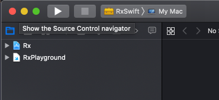

### RxSwift Operator

学习 `RxSwift` 时，可以使用 `Playground` 看一下代码效果。

参考 [rxswift](https://store.raywenderlich.com/products/rxswift) 随书脚本，可以配置 `Playground` 中 `RxSwift` 的引用， 具体步骤如下：
 

1. 建立工作目录，在工作目录下创建 playground 文件，例如文件名为：`RxPlayground.playground`
2. Xcode -> File -> New -> workspace ，名字也用  RxPlayground, 最终文件名为 `RxPlayground.xcworkspace`
3. 下载 [bootstrap.sh](https://github.com/tangyumeng/blog/blob/develop/gists/bootstrap.sh) 到工作目录，执行 `bootstrap.sh`， 获取 `RxSwift` 工程
4. 打开 `RxPlayground.xcworkspace` , Xcode -> File -> Add Files to 'RxPlayground' ... , 选择工作目录下 rx -> Libs -> RxSwift -> Rx.xcodeproj 即可
5. 然后 `Xcode` 选择 `RxSwift`   target 进行 build ，这样在 playground 中就能 import 到 RxSwift module了。
6. 点 RxPlayground 左侧的▶️ 在 source group 下创建 `SupportCode.swift` 文件， 内容如下
	<pre><code>
	import Foundation
	public func example(_ description: String, action: () -> Void) {
	  print("\n--- Example of:", description, "---")
	  action()
	}
	public enum TestError: Swift.Error {
	  case test
	}
</code></pre>

	playground 可以自动引用到 source 下面的 swift 文件
	
这样一个可以引用 `RxSwift` 库的 `playground` 环境就准备好了 
	