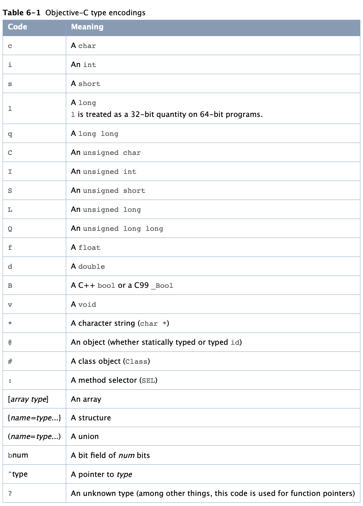

### Type Encoding 

由于运行时需要，编译器用 **char 字符串(char string)** 形式对每个方法的返回值和参数进行编码，并且对 **方法选择器(method selecor)** 和该字符串进行关联。使用 @encode 获取类型的编码字符串， 使用 runtime 一些方法获取 method 的编码字符串

#### Objective-c 类型编码

<pre><code>
- (void)testTypeEncoding {
    // char type encoding is:c
    NSLog(@"char type encoding is:%s",@encode(char));
     //int type encoding is:i
    NSLog(@"int type encoding is:%s",@encode(int));
     //short type encoding is:s
    NSLog(@"short type encoding is:%s",@encode(short));
     //long type encoding is:q
    NSLog(@"long type encoding is:%s",@encode(long));
    //long long type encoding is:q
    NSLog(@"long long type encoding is:%s",@encode(long long));

    //unsigned char type encoding is:C
    NSLog(@"unsigned char type encoding is:%s",@encode(unsigned char));
    //unsigned int type encoding is:I
    NSLog(@"unsigned int type encoding is:%s",@encode(unsigned int));
    //unsigned short type encoding is:S
    NSLog(@"unsigned short type encoding is:%s",@encode(unsigned short));
    //unsigned long type encoding is:Q
    NSLog(@"unsigned long type encoding is:%s",@encode(unsigned long));
    //unsigned long long type encoding is:Q
    NSLog(@"unsigned long long type encoding is:%s",@encode(unsigned long long));
    //float type encoding is:f
    NSLog(@"float type encoding is:%s",@encode(float));
    //double type encoding is:d
    NSLog(@"double type encoding is:%s",@encode(double));
    //bool type encoding is:B
    NSLog(@"bool type encoding is:%s",@encode(bool));
    //void type encoding is:v
    NSLog(@"void type encoding is:%s",@encode(void));
    //id type encoding is:@
    NSLog(@"id type encoding is:%s",@encode(id));
    //class type encoding is:#
    NSLog(@"class type encoding is:%s",@encode(Class));
    //SEL type encoding is :
    NSLog(@"SEL type encoding is %s",@encode(SEL));
    //IMP type encoding is:^?
    NSLog(@"IMP type encoding is:%s",@encode(IMP));
    //Method type encoding is:^{objc_method=}
    NSLog(@"Method type encoding is:%s",@encode(Method));
    //Array type encoding is:{NSArray=#}
    NSLog(@"Array type encoding is:%s",@encode(NSArray));
    
    typedef struct Person_S {
        char *name;
        float age;
    } Person_S;
    //structure type encoding is:{Person_S=*f}
    NSLog(@"structure type encoding is:%s",@encode(Person_S));
    
    typedef union {
        double  d;
        //        uint32_t  u32[2];
    } U;
    NSLog(@"union type encoding is:%s",@encode(U)); //why
    
//    指针的标准编码是加一个前置的 ^，而 char * 拥有自己的编码 *。
//   这在概念上是很好理解的，因为 C 的字符串被认为是一个实体，而不是指针。
    //char * type encoding is:*
    NSLog(@"char * type encoding is:%s",@encode(char *));
    //float * type encoding is:^f
    NSLog(@"float * type encoding is:%s",@encode(float *));
    int a = 2;
    int *b = {&a};
//    int[] --> ^i
    NSLog(@"int[] --> %s",@encode(typeof(b)));
    
    typedef struct {
        unsigned int widthValidated : 3;
        unsigned int heightValidated : 3;
    } status2;
    //bit num type encoding is:{?=b3b3}
    NSLog(@"bit num type encoding is:%s",@encode(status2));
    
}
</code></pre>

#### Type encoding 应用

有了上面的内容，可以实现判断 NSNumber 中存放内容的实际类型
from: [https://blog.csdn.net/yhawaii/article/details/8222973](https://blog.csdn.net/yhawaii/article/details/8222973)

<pre><code>- (void)testNumEncoding {
    NSDictionary *dic = [NSDictionary dictionaryWithObjectsAndKeys:
                         [NSNumber numberWithBool:YES],@"key1",
                         [NSNumber numberWithDouble:1.00f],@"key2",
                         [NSNumber numberWithInt:1],@"key3",
                         [NSNumber numberWithFloat:33.0f], @"key4", nil];
    for(NSString *key in dic){
        id value = [dic valueForKey:key];
        if([value isKindOfClass:[NSNumber class]]){
            const char * pObjCType = [((NSNumber*)value) objCType];
            if (strcmp(pObjCType, @encode(int))  == 0) {
                NSLog(@"字典中key=%@的值是int类型,值为%d",key,[value intValue]);
            }
            if (strcmp(pObjCType, @encode(float)) == 0) {
                NSLog(@"字典中key=%@的值是float类型,值为%f",key,[value floatValue]);
            }
            if (strcmp(pObjCType, @encode(double))  == 0) {
                NSLog(@"字典中key=%@的值是double类型,值为%f",key,[value doubleValue]);
            }
            if (strcmp(pObjCType, @encode(BOOL)) == 0) {
                NSLog(@"字典中key=%@的值是bool类型,值为%i",key,[value boolValue]);
            }
        }
    }
}</code></pre>

参考  

- [https://nshipster.cn/type-encodings/](https://nshipster.cn/type-encodings/)
- [https://developer.apple.com/library/archive/documentation/Cocoa/Conceptual/ObjCRuntimeGuide/Articles/ocrtPropertyIntrospection.html#//apple_ref/doc/uid/TP40008048-CH101-SW5](https://developer.apple.com/library/archive/documentation/Cocoa/Conceptual/ObjCRuntimeGuide/Articles/ocrtPropertyIntrospection.html#//apple_ref/doc/uid/TP40008048-CH101-SW5)