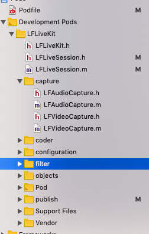

### LFLiveKit 音频采集 LFAudioCapture 

如图所示： 
LFLiveKit 中，源码文件按功能模块存放，比较清晰：
其中 LFLiveSession 处理初始化、以及各种回调(采集、编码，以及在编码回调中进行数据上传操作)，类似一个 Manager 作用的类。

capture 目录下存放的是音、视频采集相关的类 

coder 下面存放的是音视频编码的相关的类  

configuration下面存放的是音、视频采集、编码的参数配置数据  

filter 下面是 GPUImage 滤镜相关的类

在iOS中有很多方法可以进行音视频采集。如 AVCaptureDevice, AudioQueue以及Audio Unit。其中 Audio Unit是最底层的接口，它的优点是功能强大，延迟低; 而缺点是学习成本高，难度大。直播推流一般直接基于 AudioUnit 开发，定制性更好一些。
比如： 
1. 低延迟  
2. 多路声音合成并且回放
3. 回声消除、均衡器、混响器等

使用 AudioUnit 时，需要先创建一个音频会话。然后开始创建 AudioUnit

需要设置类型、自类型、厂商等参数

有两种创建 AudioUnit 的方式:   
1. 裸创建
	直接使用 AudioComponentFindNext、AudioComponentInstanceNew API 来实现. 可以参考 [LFAudioCapture.m](https://github.com/LaiFengiOS/LFLiveKit/blob/master/LFLiveKit/capture/LFAudioCapture.m) 的实现  
2. AUGraph 方式创建一般通过 
	NewAUGraph , 具体使用方法可以参考 [iOS-AudioRecorder](https://github.com/zhanxiaokai/iOS-AudioRecorder) 项目中 [AudioRecorder](https://github.com/zhanxiaokai/iOS-AudioRecorder/blob/master/AudioRecorder/AudioRecorder.m) 的实现
	

<pre><code>@interface LFAudioCapture ()

@property (nonatomic, assign) AudioComponentInstance componetInstance;
@property (nonatomic, assign) AudioComponent component;
@property (nonatomic, strong) dispatch_queue_t taskQueue;
@property (nonatomic, assign) BOOL isRunning;
@property (nonatomic, strong,nullable) LFLiveAudioConfiguration *configuration;

@end

@implementation LFAudioCapture

#pragma mark -- LiftCycle
- (instancetype)initWithAudioConfiguration:(LFLiveAudioConfiguration *)configuration{
    if(self = [super init]){
        _configuration = configuration;
        self.isRunning = NO;
        //taskQueue ,在该队列上执行 AudioUnit 操作。防止阻塞主线程
        self.taskQueue = dispatch_queue_create("com.youku.Laifeng.audioCapture.Queue", NULL);
        
        AVAudioSession *session = [AVAudioSession sharedInstance];
        //观察系统通知，主要是音频输出通道（比如扬声器到耳机），
       // 以及中断（音频采集过程中接入电话等，根据状态，停止、恢复AudioUnit）通知
        [[NSNotificationCenter defaultCenter] addObserver: self
                                                 selector: @selector(handleRouteChange:)
                                                     name: AVAudioSessionRouteChangeNotification
                                                   object: session];
        [[NSNotificationCenter defaultCenter] addObserver: self
                                                 selector: @selector(handleInterruption:)
                                                     name: AVAudioSessionInterruptionNotification
                                                   object: session];
      
//      Identifying information for an audio component.
//      描述设备的一个音频组件
        AudioComponentDescription acd;
      // 输出单元，作为 AudioUnit 的起始部分，在音频模型（pull-model）中作为输出
        acd.componentType = kAudioUnitType_Output;
      //Apple 音频输入、输出系统子类型
      //直接和 iOS 音频系统交互的接口，可以作为输入、也可以作为输出。Bus 0 和输出端相连
      //Bus 1 用来获取音频输入
        acd.componentSubType = kAudioUnitSubType_RemoteIO;
        acd.componentManufacturer = kAudioUnitManufacturer_Apple;
        acd.componentFlags = 0;
        acd.componentFlagsMask = 0;
        //使用 AudioComponentDescription
        //找到下一个和 AudioComponentDescription 描述匹配的 audio component
        self.component = AudioComponentFindNext(NULL, &acd);
        
        OSStatus status = noErr;
      //创建 audio component 实例
      //iOS 音频开发中，API 返回值要和 noErr 比较，确认当前步骤没有出错
        status = AudioComponentInstanceNew(self.component, &_componetInstance);
        
        if (noErr != status) {
            [self handleAudioComponentCreationFailure];
        }
        
        UInt32 flagOne = 1;
        //设置 audio component instance 可以作为音频输入
        AudioUnitSetProperty(self.componetInstance,
                             kAudioOutputUnitProperty_EnableIO,
                             kAudioUnitScope_Input,
                             1,
                             &flagOne,
                             sizeof(flagOne));
      
//      AudioStreamBasicDescription 提供了对音频文件的描述
//      声音是模拟信号，计算机只能识别0和1，所有需要对模拟信号进行量化，并编码。
//      音频文件的产生是模拟信号->PCM以后的数字信号->压缩、编码以后的音频文件。
//      PCM时采样频率叫做sample rate。
//      每一次采样可以得到若干采样数据，对应多个channel。
//      每一个采样点得到的若干采样数据组合起来，叫做一个frame。
//      若干frame组合起来叫做一个packet。
//      mSampleRate，就是采样频率（8k、16k、32k、44.k 等），根据 奈奎斯特–香农采样定理 一般项目中用44.1k采样率
//      https://zh.wikipedia.org/wiki/%E9%87%87%E6%A0%B7%E5%AE%9A%E7%90%86
//      mBitsPerChannel，就是每个采样数据的位数，项目中多用16bit
//      mChannelsPerFrame,可以理解为声道数，也就是一个采样时刻产生几个采样数据，一般设置2，双声道，立体声
//      mFramesPerPacket，就是每个packet的中frame的个数，等于这个packet中经历了几次采样间隔。
//      mBytesPerPacket，每个packet中数据的字节数。
//      mBytesPerFrame，每个frame中数据的字节数

        AudioStreamBasicDescription desc = {0};
        memset(&desc, 0, sizeof(AudioStreamBasicDescription));
        desc.mSampleRate = _configuration.audioSampleRate;
        desc.mFormatID = kAudioFormatLinearPCM;
        desc.mFormatFlags = kAudioFormatFlagIsSignedInteger |
                              kAudioFormatFlagsNativeEndian |
                              kAudioFormatFlagIsPacked;
        desc.mChannelsPerFrame = (UInt32)_configuration.numberOfChannels;
        desc.mFramesPerPacket = 1;
        desc.mBitsPerChannel = 16;
        desc.mBytesPerFrame = desc.mBitsPerChannel / 8 * desc.mChannelsPerFrame;
        desc.mBytesPerPacket = desc.mBytesPerFrame * desc.mFramesPerPacket;
        
        AURenderCallbackStruct cb;
        cb.inputProcRefCon = (__bridge void *)(self);
        cb.inputProc = handleInputBuffer; //回调函数
      //根据 AudioStreamBasicDescription 来设置输出数据的格式
        AudioUnitSetProperty(self.componetInstance,
                             kAudioUnitProperty_StreamFormat,
                             kAudioUnitScope_Output, 1, &desc, sizeof(desc));
        AudioUnitSetProperty(self.componetInstance,
                             kAudioOutputUnitProperty_SetInputCallback,
                             kAudioUnitScope_Global, 1, &cb, sizeof(cb));
        //初始化 一个 audio unit 实例
        status = AudioUnitInitialize(self.componetInstance);
        
        if (noErr != status) {
            [self handleAudioComponentCreationFailure];
        }
      
      //设置音频会话的首选 采样率
        [session setPreferredSampleRate:_configuration.audioSampleRate error:nil];
//category 定义应用使用音频的方式。在 active 前设置，
      if (@available(iOS 9.0, *)) {
        [session setCategory:AVAudioSessionCategoryPlayAndRecord
                 withOptions:AVAudioSessionCategoryOptionDefaultToSpeaker |
         AVAudioSessionCategoryOptionInterruptSpokenAudioAndMixWithOthers
                       error:nil];
      } else {
        // Fallback on earlier versions
        [session setCategory:AVAudioSessionCategoryPlayAndRecord withOptions:AVAudioSessionCategoryOptionDefaultToSpeaker error:nil];
      }
      
        [session setActive:YES withOptions:kAudioSessionSetActiveFlag_NotifyOthersOnDeactivation error:nil];
    }
    return self;
}

- (void)dealloc {
    [[NSNotificationCenter defaultCenter] removeObserver:self];

    dispatch_sync(self.taskQueue, ^{
        if (self.componetInstance) {
            self.isRunning = NO;
            AudioOutputUnitStop(self.componetInstance);
            AudioComponentInstanceDispose(self.componetInstance);
            self.componetInstance = nil;
            self.component = nil;
        }
    });
}

#pragma mark -- Setter
- (void)setRunning:(BOOL)running {
    if (_running == running) return;
    _running = running;
    if (_running) {
        dispatch_async(self.taskQueue, ^{
            self.isRunning = YES;
            NSLog(@"MicrophoneSource: startRunning");
            [[AVAudioSession sharedInstance] setCategory:AVAudioSessionCategoryPlayAndRecord withOptions:AVAudioSessionCategoryOptionDefaultToSpeaker | AVAudioSessionCategoryOptionInterruptSpokenAudioAndMixWithOthers error:nil];
            AudioOutputUnitStart(self.componetInstance);
        });
    } else {
        dispatch_sync(self.taskQueue, ^{
            self.isRunning = NO;
            NSLog(@"MicrophoneSource: stopRunning");
            AudioOutputUnitStop(self.componetInstance);
        });
    }
}

#pragma mark -- CustomMethod
- (void)handleAudioComponentCreationFailure {
    dispatch_async(dispatch_get_main_queue(), ^{
        [[NSNotificationCenter defaultCenter] postNotificationName:LFAudioComponentFailedToCreateNotification object:nil];
    });
}

#pragma mark -- NSNotification
- (void)handleRouteChange:(NSNotification *)notification {
    AVAudioSession *session = [ AVAudioSession sharedInstance ];
    NSString *seccReason = @"";
    NSInteger reason = [[[notification userInfo] objectForKey:AVAudioSessionRouteChangeReasonKey] integerValue];
    //  AVAudioSessionRouteDescription* prevRoute = [[notification userInfo] objectForKey:AVAudioSessionRouteChangePreviousRouteKey];
    switch (reason) {
    case AVAudioSessionRouteChangeReasonNoSuitableRouteForCategory:
        seccReason = @"The route changed because no suitable route is now available for the specified category.";
        break;
    case AVAudioSessionRouteChangeReasonWakeFromSleep:
        seccReason = @"The route changed when the device woke up from sleep.";
        break;
    case AVAudioSessionRouteChangeReasonOverride:
        seccReason = @"The output route was overridden by the app.";
        break;
    case AVAudioSessionRouteChangeReasonCategoryChange:
        seccReason = @"The category of the session object changed.";
        break;
    case AVAudioSessionRouteChangeReasonOldDeviceUnavailable:
        seccReason = @"The previous audio output path is no longer available.";
        break;
    case AVAudioSessionRouteChangeReasonNewDeviceAvailable:
        seccReason = @"A preferred new audio output path is now available.";
        break;
    case AVAudioSessionRouteChangeReasonUnknown:
    default:
        seccReason = @"The reason for the change is unknown.";
        break;
    }
    NSLog(@"handleRouteChange reason is %@", seccReason);

    AVAudioSessionPortDescription *input = [[session.currentRoute.inputs count] ? session.currentRoute.inputs : nil objectAtIndex:0];
    if (input.portType == AVAudioSessionPortHeadsetMic) {

    }
}

- (void)handleInterruption:(NSNotification *)notification {
    NSInteger reason = 0;
    NSString *reasonStr = @"";
    if ([notification.name isEqualToString:AVAudioSessionInterruptionNotification]) {
        //Posted when an audio interruption occurs.
        reason = [[[notification userInfo] objectForKey:AVAudioSessionInterruptionTypeKey] integerValue];
        if (reason == AVAudioSessionInterruptionTypeBegan) {
            if (self.isRunning) {
                dispatch_sync(self.taskQueue, ^{
                    NSLog(@"MicrophoneSource: stopRunning");
                    AudioOutputUnitStop(self.componetInstance);
                });
            }
        }

        if (reason == AVAudioSessionInterruptionTypeEnded) {
            reasonStr = @"AVAudioSessionInterruptionTypeEnded";
            NSNumber *seccondReason = [[notification userInfo] objectForKey:AVAudioSessionInterruptionOptionKey];
            switch ([seccondReason integerValue]) {
            case AVAudioSessionInterruptionOptionShouldResume:
                if (self.isRunning) {
                    dispatch_async(self.taskQueue, ^{
                        NSLog(@"MicrophoneSource: startRunning");
                        AudioOutputUnitStart(self.componetInstance);
                    });
                }
                // Indicates that the audio session is active and immediately ready to be used. Your app can resume the audio operation that was interrupted.
                break;
            default:
                break;
            }
        }

    }
    ;
    NSLog(@"handleInterruption: %@ reason %@", [notification name], reasonStr);
}

#pragma mark -- CallBack
static OSStatus handleInputBuffer(void *inRefCon,
                                  AudioUnitRenderActionFlags *ioActionFlags,
                                  const AudioTimeStamp *inTimeStamp,
                                  UInt32 inBusNumber,
                                  UInt32 inNumberFrames,
                                  AudioBufferList *ioData) {
    @autoreleasepool {
        LFAudioCapture *source = (__bridge LFAudioCapture *)inRefCon;
        if (!source) return -1;

        AudioBuffer buffer;
        buffer.mData = NULL;
        buffer.mDataByteSize = 0;
        buffer.mNumberChannels = 1;

        AudioBufferList buffers;
        buffers.mNumberBuffers = 1;
      // 1 means noninterleave，
      // https://stackoverflow.com/questions/17879933/whats-the-interleaved-audio
        buffers.mBuffers[0] = buffer;

        //一个音频渲染周期
        OSStatus status = AudioUnitRender(source.componetInstance,
                                          ioActionFlags,
                                          inTimeStamp,
                                          inBusNumber,
                                          inNumberFrames,
                                          &buffers);

        if (source.muted) {
            for (int i = 0; i < buffers.mNumberBuffers; i++) {
                AudioBuffer ab = buffers.mBuffers[i];
                memset(ab.mData, 0, ab.mDataByteSize);
            }
        }
        //每个采集到的音频数据，回调给外部，用以上传到直播服务器
        if (!status) {
            if (source.delegate && [source.delegate respondsToSelector:@selector(captureOutput:audioData:)]) {
                [source.delegate
                 captureOutput:source
                 audioData:[NSData dataWithBytes:buffers.mBuffers[0].mData
                                          length:buffers.mBuffers[0].mDataByteSize]];
            }
        }
        return status;
    }
}

@end
</code></pre>

 