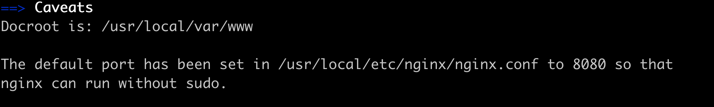

## 直播推流服务端环境配置

直播分为 **推流** 、 **拉流** 两大块。

其中 **推流** 重要包括：  
1. 采集音频、视频数据  
2. 编码音视频数据（硬编码使用系统API，软编码使用ffmpeg）  
3. 得到视频(H.264格式)、音频数据(AAC格式)  
4. 封装数据  
5. RTMP 或者其他协议上传到服务器  

学习过程中，推流服务器可以使用第三方云服务(七牛、阿里云等)。
简单起见，直接在本地配置服务器即可。同时 ffmpeg 在学习过程中也可以用到，一起配置完成即可：

在 Mac 环境下，使用 brew 命令安装 ffmpeg   

1. brew install ffmpeg --with-chromaprint --with-fdk-aac --with-fontconfig --with-freetype --with-frei0r --with-game-music-emu --with-libass --with-libbluray --with-libbs2b --with-libcaca --with-libgsm --with-libmodplug --with-librsvg --with-libsoxr --with-libssh --with-libvidstab --with-libvorbis --with-libvpx --with-opencore-amr --with-openh264 --with-openjpeg --with-openssl --with-opus --with-rtmpdump --with-rubberband --with-sdl2 --with-snappy --with-speex --with-srt --with-tesseract --with-theora --with-tools --with-two-lame --with-wavpack --with-webp --with-x265 --with-xz --with-zeromq --with-zimg  
2. `brew install nginx-full --with-rtmp-module` 安装 nginx
3. 执行 `brew info nginx-full` 找到 nginx.conf 的位置

一般位置是： `/usr/local/etc/nginx/nginx.conf`
4. 在文件末尾添加一些代码，支持 rtmp 协议：
<pre><code>rtmp {
		server {
		    listen 1935;
			    application rtmplive {
			        live on;
			        record off;
			    }
		}
}</code></pre>
5. 执行 `nginx -s reload` , 让对 nginx.conf 的修改生效。
6. 如果地 5 步 报错 ` nginx: [emerg] unknown directive "rtmp" in /usr/local/etc/nginx/nginx.conf:119`,则执行 `brew uninstall nginx-full` , `  brew install nginx-full --with-rtmp-module` 以解决错误
7. 如果报错 `nginx: [error] open() "/usr/local/var/run/nginx.pid" failed (2: No such file or directory)` , 则执行 `nginx -c /usr/local/etc/nginx/nginx.conf  ` , `nginx -s reload` 即可解决。

以上步骤配置完成，即可提供推流服务器地址： 
`rtmp://192.168.1.2:1935/rtmplive/room`， 其中 `192.168.1.2` 是 Mac 电脑的 IP 地址。

如果后面推流失败， 可以终端执行如下命令，重启 nginx 服务即可：  
1.  /usr/local/Cellar/nginx-full/1.14.0/bin/nginx -c /usr/local/etc/nginx/nginx.conf  
2. /usr/local/Cellar/nginx-full/1.14.0/bin/nginx -t -c /usr/local/etc/nginx/nginx.conf   
3. nginx -s reload

通过上述配置，可以提供客户端推流地址，结合后面的客户端推流，可以完成一个demo 测试。使用 ffmpeg 提供的 ffplay 测试拉流服务。iOS 也可以使用 ijkplayer 来播放 rtmp 流。