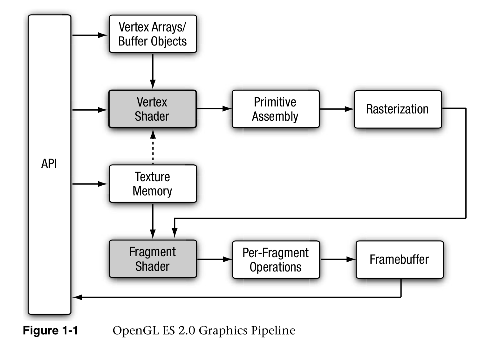
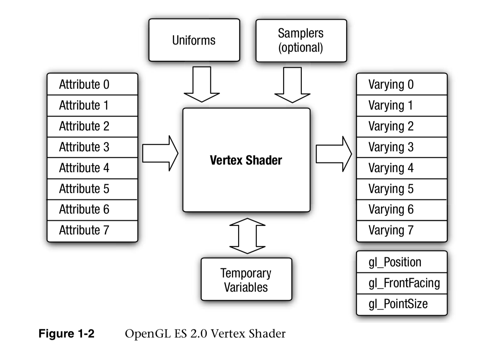

OpenGL ES
OpenGL ES (OpenGL for Embedded Systems) 是 OpenGL 三维图形 API 的子集，针对手机、PDA和游戏主机等嵌入式设备而设计。
目前有三个常用的版本   
1.x,2.x,3.x   
1.x 版本固定管线   
2.x 版本引入可编程管线

[GLSL 基础](https://www.tuicool.com/articles/yEBFvmA)

GLSL中有4个限定符（variable qualifiers）可供使用，它们限定了被标记的变量不能被更改的"范围"。

1. const  
2. attribute  
3. uniform  
4. varying  

#### const

const 和 C++ 里差不多，定义不可变常量。表示限定的变量在编译时不可被修改

#### attribute   
attribute是应用程序传给顶点着色器用的。不允许声明时初始化  
attribute限定符标记的是一种全局变量,该变量在顶点着色器中是只读（read-only）的，该变量被用作从OpenGL应用程序向顶点着色器中传递参数，因此该限定符仅能用于顶点着色器。

#### uniform

unifrom一般是应用程序用于设定顶点着色器和片断着色器相关初始化值。
不允许声明时初始化  
uniform限定符标记的是一种全局变量,该变量对于一个图元（primitive）来说是不可更改的 它可以从OpenGL应用程序中接收传递来的参数。

#### varying
varying用于传递顶点着色器的值给片断着色器。不允许声明时初始化  
它提供了从顶点着色器向片段着色器传递数据的方法，varying限定符可以在顶点着色器中定义变量，然后再传递给光栅化器，光栅化器对数据插值后，再将每个片段的值交给片段着色器。

### 顶点着色器(Vertex Shader)
1. 输入
	2. 	Attributes (使用顶点数组提供每个顶点的数据)
	3. Uniforms  (顶点着色器使用的常量数据)
	4. Samples (顶点着色器使用的纹理对象。）
	5. Shader program (描述在顶点上的操作的源码)
2. 输出
	3. 	varying variables
	在 primitive rasterization(图元光栅化) 阶段， 可变值会为每个生成的片段进行计算，并且传入片段着色器中作为输入
	
顶点着色器的输入、输出如下图所示

### 图元装配
顶点着色器后的步骤是图元装配, 图元是 OPenGL ES 中可以用适当命令绘制的几何对象（点、线 、三角形）, 绘制命令指定描述图元的几何属性和图元类型的集合
