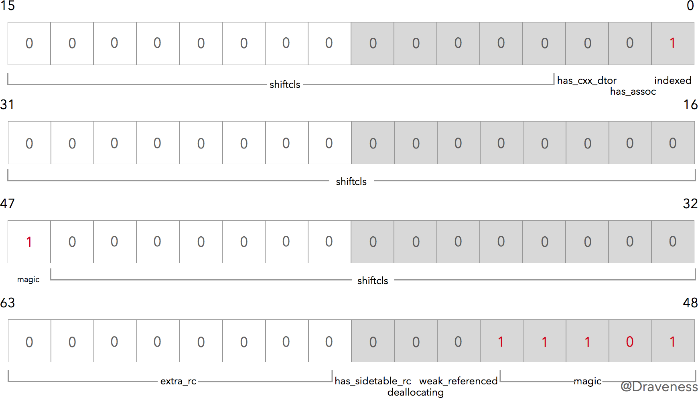
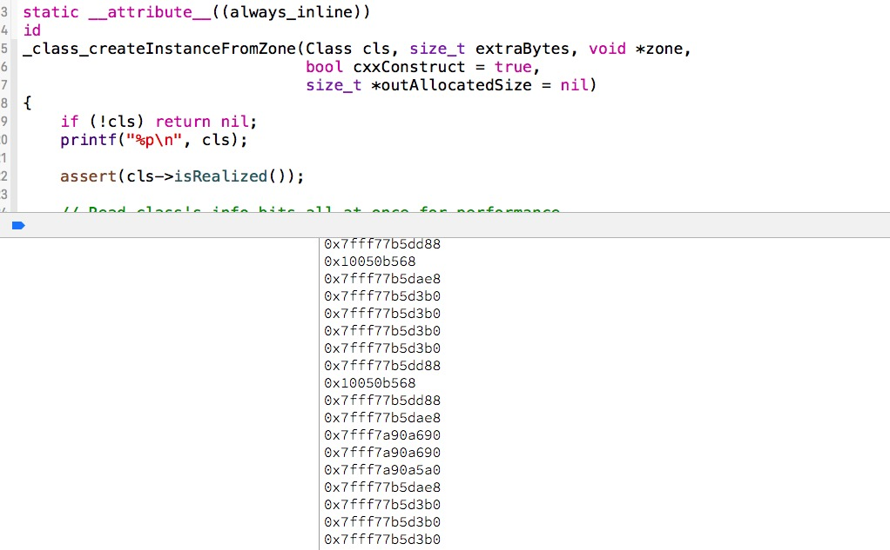

###  从 NSObject 的初始化了解 isa


####  OC的类是一个结构体

所有的OC类其实都是一个c语言的结构体，可以通过 `clang -rewrite-objc xxx.m ` 命令重写OC类为C++类。来理解OC的类就是一个C语言的结构体。下面是重写的实例，类的定义如下：

```swift
// .h 实现
#import <Foundation/Foundation.h>

NS_ASSUME_NONNULL_BEGIN

@interface MyClass : NSObject

@property (nonatomic, strong) NSString *name;

- (void)printName;

@end
NS_ASSUME_NONNULL_END


// .m 实现
#import "MyClass.h"

@implementation MyClass

- (void)printName {
    NSLog(@"MyClass printName");
}

@end
```

执行 `clang -rewrite-objc MyClass.m` 后， 从 MyClass.cpp 中可以找到 `typedef struct objc_object MyClass;` 可以知道 OC 类是一个结构体。 

从 runtime 源码中可以找到 

```swift

struct objc_object {
    isa_t isa;
};
```

objc_object结构中只有一个 `isa_t`类型成员。所以我们可以说含有isa的结构体都是一个对象。即： 所有继承自 `NSObject` 的类实例化后的对象都会包含一个类型为 `isa_t` 的结构体。

虽然上面重写 MyClass 后的C语言结构体是一个 `objc_object` 对象，但实际上他是一个`objc_class`结构体，由于`objc_class`继承与`objc_object`， 所以本质上`objc_class` 也是一个`objc_object`结构。
`objc_class`定义如下：

```swfit
struct objc_class : objc_object {
    isa_t isa;
    Class superclass;
    cache_t cache;
    class_data_bits_t bits;
};
```

> 由于 `objc_class` 结构体是继承自 `objc_object` 的，所以在这里显式地写出了 `isa_t isa` 这个成员变量。

到这里，我们可以确认：**Objective-C 中类也是一个对象**。

#### `isa` 指针的作用与元类

`isa` 包含了什么呢？回答这个问题之前，要引入了另一个概念 *元类(meta class)*，我们先了解一些关于元类的信息。

因为在 Objective-C 中，对象的方法并**没有存储于对象的结构体中**（如果每一个对象都保存了自己能执行的方法，那么对内存的占用有极大的影响）。

当**实例方法**被调用时，它要通过自己持有的 `isa` 来查找对应的类，然后在这里的 `class_data_bits_t` 结构体中查找对应方法的实现。同时，每一个 `objc_class` 也有一个**指向自己的父类的指针** `super_class` 用来查找继承的方法。

> 关于如何在 `class_data_bits_t` 中查找对应方法会在之后的文章中讲到。这里只需要知道，它会在这个结构体中查找到对应方法的实现就可以了。[深入解析 ObjC 中方法的结构](https://github.com/Draveness/iOS-Source-Code-Analyze/blob/master/contents/objc/深入解析 ObjC 中方法的结构.md)


但是，这样就有一个问题，类方法的实现又是如何查找并且调用的呢？这时，就需要引入*元类*来保证无论是类还是对象都能**通过相同的机制查找方法的实现**。

让每一个类的 `isa` 指向对应的元类，这样就达到了使类方法和实例方法的调用机制相同的目的：

- 实例方法调用时，通过对象的 `isa` 在类中获取方法的实现
- 类方法调用时，通过类的 `isa` 在元类中获取方法的实现

下面这张图介绍了对象，类与元类之间的关系。 


####  结构体 `isa_t`
其实 `isa_t` 是一个定义得非常”奇怪”的结构体，在 ObjC 源代码中可以看到这样的定义：

```swift
#define ISA_MASK        0x00007ffffffffff8ULL
#define ISA_MAGIC_MASK  0x001f800000000001ULL
#define ISA_MAGIC_VALUE 0x001d800000000001ULL
#define RC_ONE   (1ULL<<56)
#define RC_HALF  (1ULL<<7)

union isa_t {
    isa_t() { }
    isa_t(uintptr_t value) : bits(value) { }

    Class cls;
    uintptr_t bits;

    struct {
        uintptr_t indexed           : 1;
        uintptr_t has_assoc         : 1;
        uintptr_t has_cxx_dtor      : 1;
        uintptr_t shiftcls          : 44;
        uintptr_t magic             : 6;
        uintptr_t weakly_referenced : 1;
        uintptr_t deallocating      : 1;
        uintptr_t has_sidetable_rc  : 1;
        uintptr_t extra_rc          : 8;
    };
};
```

> 这是在 `__x86_64__` 上的实现，对于架构为 `__arm64__` 的设备上，具体结构体的实现和位数可能有些差别，不过这些字段都是存在的

**本文以 `__x86_64__` 为例进行分析，而不会对两种架构下由于不同的内存布局方式导致的差异进行分析**。

为了便于理解， 下面附上一张 `is_a`字段展示图

 


`isa_t` 是一个 `union` 类型的结构体，对 `union` 不熟悉的读者可以看这个 stackoverflow 上的[回答](http://stackoverflow.com/questions/252552/why-do-we-need-c-unions). 也就是说其中的 `cls`、 `bits` 还有结构体共用同一块地址空间。而 `isa` 总共会占据 64 位的内存空间（决定于其中的结构体）.

下图是网上获取的一张 `is_a` 字段解释图


#### `isa` 的初始化

我们可以通过 `isa` 初始化的方法 `initIsa` 来初步了解这 64 位的 bits 的作用：

```swift
///定义位于objc-object.h文件
inline void 
objc_object::initInstanceIsa(Class cls, bool hasCxxDtor)
{
    initIsa(cls, true, hasCxxDtor);
}

inline void 
objc_object::initIsa(Class cls, bool indexed, bool hasCxxDtor) 
{ 
    if (!indexed) {
        isa.cls = cls;
    } else {
        isa.bits = ISA_MAGIC_VALUE;
        isa.has_cxx_dtor = hasCxxDtor;
        isa.shiftcls = (uintptr_t)cls >> 3;
    }
}
```

#### `indexed` 和 `magic`

当我们对一个 ObjC 对象分配内存时，其方法调用栈中包含了上述的两个方法，这里关注的重点是 `initIsa` 方法，由于在 `initInstanceIsa` 方法中传入了 `indexed = true`，所以，我们简化一下这个方法的实现：

```swift
inline void objc_object::initIsa(Class cls, bool indexed, bool hasCxxDtor) 
{ 
    isa.bits = ISA_MAGIC_VALUE;
    isa.has_cxx_dtor = hasCxxDtor;
    isa.shiftcls = (uintptr_t)cls >> 3;
}
```

对整个 `isa` 的值 `bits` 进行设置，传入 `ISA_MAGIC_VALUE`：

```swift
#define ISA_MAGIC_VALUE 0x001d800000000001ULL
```

我们可以把它转换成二进制的数据，然后看一下哪些属性对应的位被这行代码初始化了（标记为红色）：



从图中了解到，在使用 `ISA_MAGIC_VALUE` 设置 `isa_t` 结构体之后，实际上只是设置了 `indexed` 以及 `magic` 这两部分的值。

- 其中 `indexed` 表示 `isa_t` 的类型

  0 表示 `raw isa`，也就是没有结构体的部分，访问对象的 `isa` 会直接返回一个指向 `cls` 的指针，也就是在 iPhone 迁移到 64 位系统之前时 isa 的类型。

  ```swift
  union isa_t {
      isa_t() { }
      isa_t(uintptr_t value) : bits(value) { }
  
      Class cls;
      uintptr_t bits;
  };
  ```

  1 表示当前 `isa` 不是指针，但是其中也有 `cls` 的信息，只是其中**关于类的指针都是保存在 `shiftcls` 中**。 
	
	```swift 
	union isa_t {
	    isa_t() { }
	    isa_t(uintptr_t value) : bits(value) { }
	
	    Class cls;
	    uintptr_t bits;
	
	    struct {
	        uintptr_t indexed           : 1;
	        uintptr_t has_assoc         : 1;
	        uintptr_t has_cxx_dtor      : 1;
	        uintptr_t shiftcls          : 44;
	        uintptr_t magic             : 6;
	        uintptr_t weakly_referenced : 1;
	        uintptr_t deallocating      : 1;
	        uintptr_t has_sidetable_rc  : 1;
	        uintptr_t extra_rc          : 8;
	    };
	};

- `magic` 的值为 `0x3b` 用于调试器判断当前对象是真的对象还是没有初始化的空间

#####  `has_cxx_dtor`

在设置 `indexed` 和 `magic` 值之后，会设置 `isa` 的 `has_cxx_dtor`，这一位表示当前对象有 C++ 或者 ObjC 的析构器(destructor)，如果没有析构器就会快速释放内存。

```swift
isa.has_cxx_dtor = hasCxxDtor;
```


##### `shiftcls`

在为 `indexed`、 `magic` 和 `has_cxx_dtor` 设置之后，我们就要将当前对象对应的类指针存入 `isa` 结构体中了。

```
isa.shiftcls = (uintptr_t)cls >> 3;
```

>  **将当前地址右移三位的主要原因是用于将 Class 指针中无用的后三位清除减小内存的消耗，因为类的指针要按照字节（8 bits）对齐内存，其指针后三位都是没有意义的 0**。
> 
>  绝大多数机器的架构都是 [byte-addressable](https://en.wikipedia.org/wiki/Byte_addressing) 的，但是对象的内存地址必须对齐到字节的倍数，这样可以提高代码运行的性能，在 iPhone5s 中虚拟地址为 33 位，所以用于对齐的最后三位比特为 `000`，我们只会用其中的 30 位来表示对象的地址。

而 ObjC 中的类指针的地址后三位也为 0，在 `_class_createInstanceFromZone` 方法中打印了调用这个方法传入的类指针：



可以看到，这里打印出来的**所有类指针十六进制地址的最后一位都为 8 或者 0**。也就是说，类指针的后三位都为 0，所以，我们在上面存储 `Class` 指针时右移三位是没有问题的。

```
isa.shiftcls = (uintptr_t)cls >> 3;
```

如果再尝试打印对象指针的话，会发现所有对象内存地址的**后四位**都是 0，说明 ObjC 在初始化内存时是以 16 个字节对齐的, 分配的内存地址后四位都是 0。


>使用整个指针大小的内存来存储 `isa` 指针有些浪费，尤其在 64 位的 CPU 上。在 `ARM64` 运行的 iOS 只使用了 33 位作为指针(与结构体中的 33 位无关，Mac OS 上为 47 位)，而剩下的 31 位用于其它目的。类的指针也同样根据字节对齐了，每一个类指针的地址都能够被 8 整除，也就是使最后 3 bits 为 0，为 `isa` 留下 34 位用于性能的优化。
>
>Using an entire pointer-sized piece of memory for the isa pointer is a bit wasteful, especially on 64-bit CPUs which don’t use all 64 bits of a pointer. ARM64 running iOS currently uses only 33 bits of a pointer, leaving 31 bits for other purposes. Class pointers are also aligned, meaning that a class pointer is guaranteed to be divisible by 8, which frees up another three bits, leaving 34 bits of the isa available for other uses. Apple’s ARM64 runtime takes advantage of this for some great performance improvements.
> from [ARM64 and You](https://www.mikeash.com/pyblog/friday-qa-2013-09-27-arm64-and-you.html)

### 其它 bits

在 `isa_t` 中，我们还有一些没有介绍的其它 bits，在这个小结就简单介绍下这些 bits 的作用

- ```
  has_assoc
  ```

  - 对象含有或者曾经含有关联引用，没有关联引用的可以更快地释放内存

- ```
  weakly_referenced
  ```

  - 对象被指向或者曾经指向一个 ARC 的弱变量，没有弱引用的对象可以更快释放

- ```
  deallocating
  ```

  - 对象正在释放内存

- ```
  has_sidetable_rc
  ```

  - 对象的引用计数太大了，存不下

- ```
  extra_rc
  ```

  - 对象的引用计数超过 1，会存在这个这个里面，如果引用计数为 10，`extra_rc` 的值就为 9
