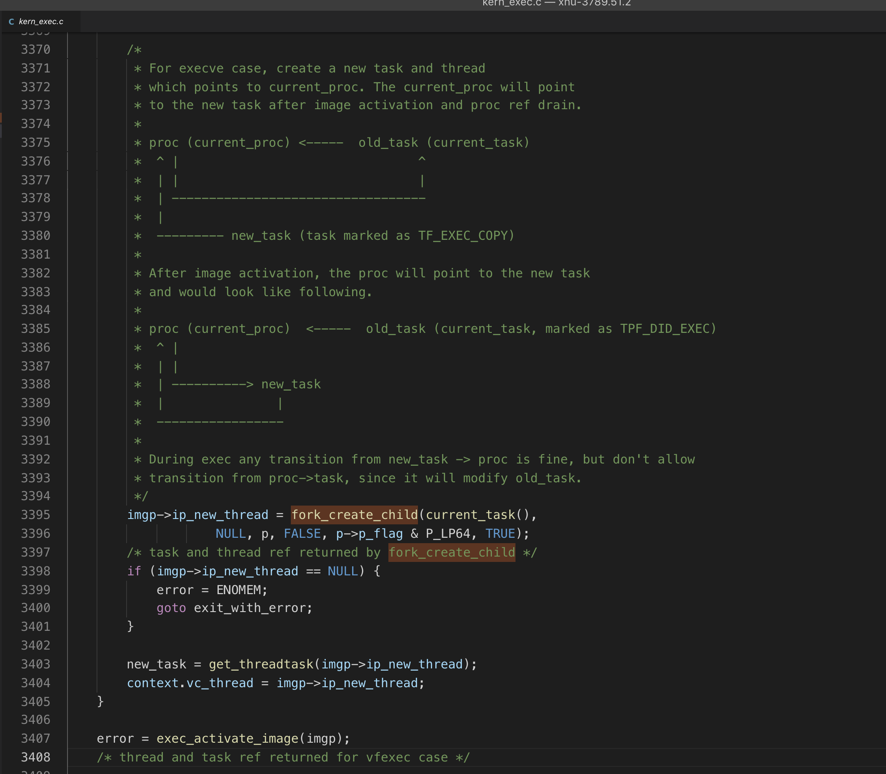
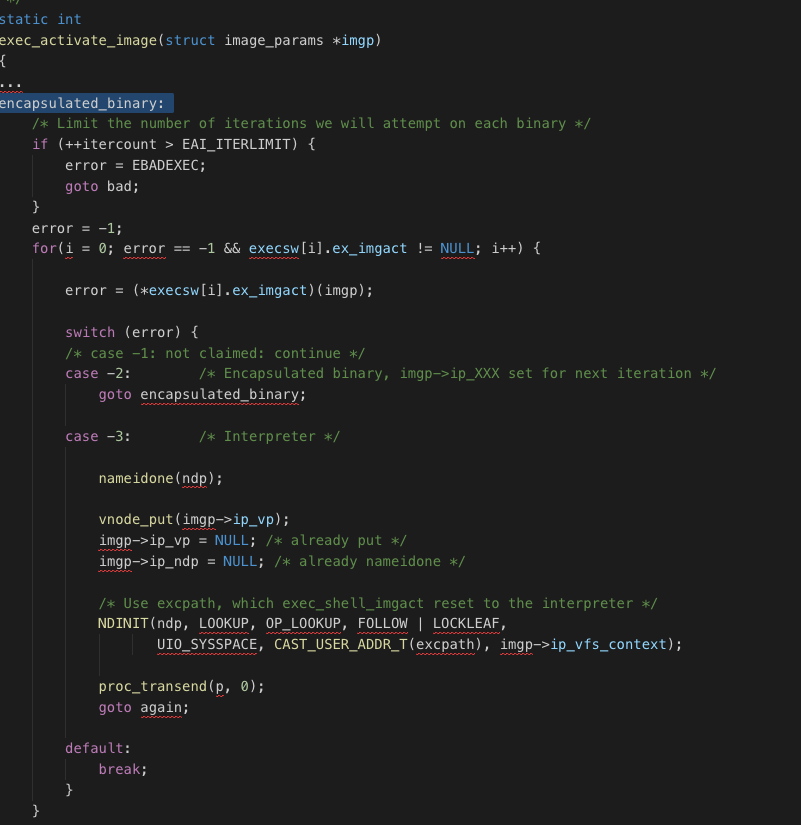
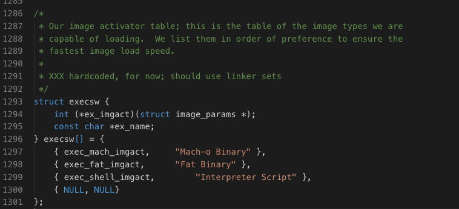
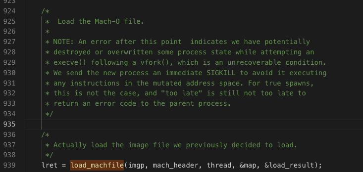

### Mach-O 和 dyld 的加载


一个应用对应一个进程，也就是说 App 是跑在一个进程上。
进程是谁创建的？ 可能有人会答：操作系统创建的。  
也可以这么说，更具体的说法应该是 XNU 内核创建的  
XNU 是 Darwin 的核心,据说是 XNU's Not Unix 的递归缩写，文字游戏。  

本身包括一下几个组件构成:   
- Mach 微内核
- BSD  层
- libKern
- I/O Kit


Mach 微内核的主要工作是：  
1. 进程和线程的抽象  
2. 虚拟内存管理  
3. 任务调度  
4. 进程间通信和消息传递机制

what(资源管理-虚拟内存管理)  
how(进程线程、通信同步等)


BSD层是建立在 Mach 层之上，提供更高层次的抽象， 包括:   
1. UNIX 进程模型  
2. POSIX线程模型(pthread)及相关的同步原语  
3. UNIX 用户和组  
4. 网络协议栈（BSD Socket API）  
5. 文件系统访问   
6. 设备访问   


当打开 Mac 或者 iOS 设备电源时， 引导加载器(OS X: EFI，iOS: iBoot)开始查找内核并启动内核。用户态的应用程序是系统中负责真正工作的实体，应用程序构建在内核提供的原语之上，向用户提供用户态环境，包括文件、多媒体、用户交互等。整个用户环境必须从某个地方启动，在 OS X 和 iOS 中，用户环境从 launchd 开始。


launchd作用系统中第一个用户态进程，负责直接或着间接地启动系统中的其他进程。由内核直接启动。

从苹果开源的 XNU 源码可以看到 
首先是从 `bsd_ast()` 调用到 `bsd_init()` , 然后 `bsd_init()` 又调用到 `load_init_program(proc_t p)` 方法。而 `load_init_program `又会调用 `load_init_program_at_path`, `load_init_program_at_path ` 调用 `execve` 函数，而 `execve()` 函数是加载`Mach-O`文件的入口

其中 ast 是 Asynchronous Software Trap 的缩写，异步软件陷阱。操作系统中，软件陷阱会引起用户态到内核态的切换（可以参考 [https://www.jianshu.com/p/e56c3d28e77d](https://www.jianshu.com/p/e56c3d28e77d)），代码执行到`load_init_program(proc_t p)` 方法后，找到关键部分代码
<pre><code>error = ENOENT;
	for (i = 0; i < sizeof(init\_programs)/sizeof(init\_programs[0]); i++) {
		error = load\_init\_program\_at\_path(p, (user_addr_t)scratch_addr, init_programs[i]);
		if (!error)
			return;
	}
</code></pre>

跳转到 `init_programs` 的定义可以看到： 
<pre><code>static const char * init_programs[] = {
\#if DEBUG
	"/usr/local/sbin/launchd.debug",
\#endif
\#if DEVELOPMENT || DEBUG
	"/usr/local/sbin/launchd.development",
\#endif
	"/sbin/launchd",
};</code></pre>

代码中是 launchd 的路径，`load_init_program_at_path`方法，根据传入的路径参数等信息，调用 `execve(proc_t p, struct execve_args *uap, int32_t *retval)` 方法，execve 内部又对参数进行封装，然后调用 `__mac_execve(proc_t p, struct __mac_execve_args *uap, int32_t *retval)` 方法，而 `__mac_execve` 函数会使用`fork_create_child()`函数启动新进程，之后使用新的进程，生成新的task。`__mac_execve()`函数的主要功能就是干这个，之后就调用了`exec_activate_image()`函数。代码(来自苹果开源的 XNU)如下图： 



`exec_activate_image` 主要核心功能是根据二进制文件的不同格式，执行不同的内存映射函数。该部分代码如下图：



其中 `error = (*execsw[i].ex_imgact)(imgp);
` 可以跳转到 execsw 定义处： 

一个结构体的数组，里面是不同文件格式的函数指针，在 exec_activate_image 的 `(*execsw[i].ex_imgact)(imgp);` 语句出选择正确的函数进行不同格式文件的的内存映射操作。


比如进入到加载 Mach-O 文件到函数 `static int
exec_mach_imgact(struct image_params *imgp)` , 
主要实现如下:

<pre><code>
static int
exec_mach_imgact(struct image_params *imgp){
	...
//	判断是否是 Mach-O 1.0 或者 Mach-O 2.0 二进制
	if ((mach_header->magic == MH_CIGAM) ||
	    (mach_header->magic == MH_CIGAM_64)) {
		error = EBADARCH;
		goto bad;
	}
	//	确保是可执行文件
	if (mach_header->filetype != MH_EXECUTE) {
		error = -1;
		goto bad;
	}
	cputype 、cpusubtype
	if (imgp->ip_origcputype != 0) {
		if (imgp->ip_origcputype != mach_header->cputype ||
			imgp->ip_origcpusubtype != mach_header->cpusubtype) {
			error = EBADARCH;
			goto bad;
		}
	} else {
		imgp->ip_origcputype = mach_header->cputype;
		imgp->ip_origcpusubtype = mach_header->cpusubtype;
	}

​	
	...


	/* reset local idea of thread, uthread, task */
	thread = imgp->ip_new_thread;
	uthread = get_bsdthread_info(thread);
	task = new_task = get_threadtask(thread);
	
	/*
	 *	Load the Mach-O file.
	 *
	 * NOTE: An error after this point  indicates we have potentially
	 * destroyed or overwritten some process state while attempting an
	 * execve() following a vfork(), which is an unrecoverable condition.
	 * We send the new process an immediate SIGKILL to avoid it executing
	 * any instructions in the mutated address space. For true spawns,
	 * this is not the case, and "too late" is still not too late to
	 * return an error code to the parent process.
	 */
	
	/*
	 * Actually load the image file we previously decided to load.
	 */
	// 加载Mach-O文件，如果返回LOAD_SUCCESS,binary已经映射成可执行内存
	lret = load_machfile(imgp, mach_header, thread, &map, &load_result);
	... //删去错误判断、方便看主流程
	
	proc_lock(p);
	p->p_cputype = imgp->ip_origcputype;
	p->p_cpusubtype = imgp->ip_origcpusubtype;
	proc_unlock(p);
	
	vm_map_set_user_wire_limit(map, p->p_rlimit[RLIMIT_MEMLOCK].rlim_cur);
	
	/* 
	 * Set code-signing flags if this binary is signed, or if parent has
	 * requested them on exec.
	 */
	if (load_result.csflags & CS_VALID) {
		imgp->ip_csflags |= load_result.csflags & 
			(CS_VALID|CS_SIGNED|CS_DEV_CODE|
			 CS_HARD|CS_KILL|CS_RESTRICT|CS_ENFORCEMENT|CS_REQUIRE_LV|
			 CS_ENTITLEMENTS_VALIDATED|CS_DYLD_PLATFORM|
			 CS_ENTITLEMENT_FLAGS|
			 CS_EXEC_SET_HARD|CS_EXEC_SET_KILL|CS_EXEC_SET_ENFORCEMENT);
	} else {
		imgp->ip_csflags &= ~CS_VALID;
	}
	
	if (p->p_csflags & CS_EXEC_SET_HARD)
		imgp->ip_csflags |= CS_HARD;
	if (p->p_csflags & CS_EXEC_SET_KILL)
		imgp->ip_csflags |= CS_KILL;
	if (p->p_csflags & CS_EXEC_SET_ENFORCEMENT)
		imgp->ip_csflags |= CS_ENFORCEMENT;
	if (p->p_csflags & CS_EXEC_SET_INSTALLER)
		imgp->ip_csflags |= CS_INSTALLER;
	
	/*
	 * Set up the system reserved areas in the new address space.
	 */
	vm_map_exec(map, task, load_result.is64bit, (void *)p->p_fd->fd_rdir, cpu_type());
	
	/*
	 * Close file descriptors which specify close-on-exec.
	 */
	fdexec(p, psa != NULL ? psa->psa_flags : 0);
	
	/*
	 * deal with set[ug]id.
	 */
	error = exec_handle_sugid(imgp);
	if (error) {
		vm_map_deallocate(map);
	
		KERNEL_DEBUG_CONSTANT(BSDDBG_CODE(DBG_BSD_PROC, BSD_PROC_EXITREASON_CREATE) | DBG_FUNC_NONE,
						p->p_pid, OS_REASON_EXEC, EXEC_EXIT_REASON_SUGID_FAILURE, 0, 0);
		exec_failure_reason = os_reason_create(OS_REASON_EXEC, EXEC_EXIT_REASON_SUGID_FAILURE);
		goto badtoolate;
	}
	
	...
	
	//activate_exec_state()函数中主要是调用了thread_setentrypoint()函数
	lret = activate_exec_state(task, p, thread, &load_result);
	
	...
	...
}
	
</code></pre>    

其中有两个关键调用：   
1.  `load_machfile `  
2.  `activate_exec_state`
除去前面对各种异常判断、线程操作等，可以找到


```
load_return_t
load_machfile(
	struct image_params	*imgp,
	struct mach_header	*header,
	thread_t 		thread,
	vm_map_t 		*mapp,
	load_result_t		*result
)
```
`load_machfile` 函数会为 `Mach-O` 文件分配虚拟内存，计算 `Mach-O` 文件和dyld 随机偏移量([aslr](aslr))的值。


<pre><code>load_return_t
load_machfile(
	struct image_params	*imgp,
	struct mach_header	*header,
	thread_t 		thread,
	vm_map_t 		*mapp,
	load_result_t		*result
)
{
	struct vnode		*vp = imgp->ip_vp;
	off_t			file_offset = imgp->ip_arch_offset;
	off_t			macho_size = imgp->ip_arch_size;
	off_t			file_size = imgp->ip_vattr->va_data_size;
	pmap_t			pmap = 0;	/* protected by create_map */
	vm_map_t		map;
	load_result_t		myresult;
	load_return_t		lret;
	boolean_t enforce_hard_pagezero = TRUE;
	int in_exec = (imgp->ip_flags & IMGPF_EXEC);
	task_t task = current_task();
	proc_t p = current_proc();
	mach_vm_offset_t	aslr_offset = 0;
	mach_vm_offset_t	dyld_aslr_offset = 0;
	kern_return_t 		kret;

	if (macho_size > file_size) {
		return(LOAD_BADMACHO);
	}
	
	result->is64bit = ((imgp->ip_flags & IMGPF_IS_64BIT) == IMGPF_IS_64BIT);
	
	task_t ledger_task;
	if (imgp->ip_new_thread) {
		ledger_task = get_threadtask(imgp->ip_new_thread);
	} else {
		ledger_task = task;
	}
	//为当前task 分配内存
	pmap = pmap_create(get_task_ledger(ledger_task),
			   (vm_map_size_t) 0,
			   result->is64bit);
	//创建虚拟内存空间 
	map = vm_map_create(pmap,
			0,
			vm_compute_max_offset(result->is64bit),
			TRUE);
	
	...
	
	/* Forcibly disallow execution from data pages on even if the arch
	 * normally permits it. */
	if ((header->flags & MH_NO_HEAP_EXECUTION) && !(imgp->ip_flags & IMGPF_ALLOW_DATA_EXEC))
		vm_map_disallow_data_exec(map);
	
	/*
	 * Compute a random offset for ASLR, and an independent random offset for dyld.
	 */
	 //计算 dyld 的随机偏移量
	if (!(imgp->ip_flags & IMGPF_DISABLE_ASLR)) {
		uint64_t max_slide_pages;
	
		max_slide_pages = vm_map_get_max_aslr_slide_pages(map);
		// binary（mach-o文件）随机的ASLR
		aslr_offset = random();
		aslr_offset %= max_slide_pages;
		aslr_offset <<= vm_map_page_shift(map);
	   //dyld 的 aslr 
		dyld_aslr_offset = random();
		dyld_aslr_offset %= max_slide_pages;
		dyld_aslr_offset <<= vm_map_page_shift(map);
	}
	
	if (!result)
		result = &myresult;
	
	*result = load_result_null;
	
	/*
	 * re-set the bitness on the load result since we cleared the load result above.
	 */
	result->is64bit = ((imgp->ip_flags & IMGPF_IS_64BIT) == IMGPF_IS_64BIT);
	//又是一个大的函数
	lret = parse_machfile(vp, map, thread, header, file_offset, macho_size,
	                      0, (int64_t)aslr_offset, (int64_t)dyld_aslr_offset, result,
			      NULL, imgp);
	
	if (lret != LOAD_SUCCESS) {
		vm_map_deallocate(map);	/* will lose pmap reference too */
		return(lret);
	}
	
	...
	/*
	 * Check to see if the page zero is enforced by the map->min_offset.
	 */ 
	if (enforce_hard_pagezero &&
	    (vm_map_has_hard_pagezero(map, 0x1000) == FALSE)) {
		{
			vm_map_deallocate(map);	/* will lose pmap reference too */
			return (LOAD_BADMACHO);
		}
	}
	
	vm_commit_pagezero_status(map);
	
	/*
	 * If this is an exec, then we are going to destroy the old
	 * task, and it's correct to halt it; if it's spawn, the
	 * task is not yet running, and it makes no sense.
	 */
	if (in_exec) {
		/*
		 * Mark the task as halting and start the other
		 * threads towards terminating themselves.  Then
		 * make sure any threads waiting for a process
		 * transition get informed that we are committed to
		 * this transition, and then finally complete the
		 * task halting (wait for threads and then cleanup
		 * task resources).
		 *
		 * NOTE: task_start_halt() makes sure that no new
		 * threads are created in the task during the transition.
		 * We need to mark the workqueue as exiting before we
		 * wait for threads to terminate (at the end of which
		 * we no longer have a prohibition on thread creation).
		 *
		 * Finally, clean up any lingering workqueue data structures
		 * that may have been left behind by the workqueue threads
		 * as they exited (and then clean up the work queue itself).
		 */
		kret = task_start_halt(task);
		if (kret != KERN_SUCCESS) {
			vm_map_deallocate(map);	/* will lose pmap reference too */
			return (LOAD_FAILURE);
		}
		proc_transcommit(p, 0);
		workqueue_mark_exiting(p);
		task_complete_halt(task);
		workqueue_exit(p);
		kqueue_dealloc(p->p_wqkqueue);
		p->p_wqkqueue = NULL;
		/*
		 * Roll up accounting info to new task. The roll up is done after
		 * task_complete_halt to make sure the thread accounting info is
		 * rolled up to current_task.
		 */
		task_rollup_accounting_info(get_threadtask(thread), task);
	}
	*mapp = map;
	return(LOAD_SUCCESS);
}</code></pre>


`parse_machfile` 函数的工作主要有三个：   
1. `Mach-O` 文件的解析，以及对每个`segment`进行内存分配    
2. `dyld` 的加载   
3. `dyld` 的解析以及虚拟内存分配  


<pre><code>/*
 * The file size of a mach-o file is limited to 32 bits; this is because
 * this is the limit on the kalloc() of enough bytes for a mach_header and
 * the contents of its sizeofcmds, which is currently constrained to 32
 * bits in the file format itself.  We read into the kernel buffer the
 * commands section, and then parse it in order to parse the mach-o file
 * format load_command segment(s).  We are only interested in a subset of
 * the total set of possible commands. If "map"==VM_MAP_NULL or
 * "thread"==THREAD_NULL, do not make permament VM modifications,
 * just preflight the parse.
 */
 //这里的英文注释表明： mach-o 文件的大小被限制在 32bits。 
static
load_return_t
parse_machfile(
	struct vnode 		*vp,       
	vm_map_t		map,
	thread_t		thread,
	struct mach_header	*header,
	off_t			file_offset,
	off_t			macho_size,
	int			depth,
	int64_t			aslr_offset,
	int64_t			dyld_aslr_offset,
	load_result_t		*result,
	load_result_t		*binresult,
	struct image_params	*imgp
)
{
	uint32_t		ncmds;
	struct load_command	*lcp;
	struct dylinker_command	*dlp = 0;
	integer_t		dlarchbits = 0;
	void *			control;
	load_return_t		ret = LOAD_SUCCESS;
	caddr_t			addr;
	void *			kl_addr;
	vm_size_t		size,kl_size;
	size_t			offset;
	size_t			oldoffset;	/* for overflow check */
	int			pass;
	proc_t			p = current_proc();		/* XXXX */
	int			error;
	int 			resid = 0;
	size_t			mach_header_sz = sizeof(struct mach_header);
	boolean_t		abi64;
	boolean_t		got_code_signatures = FALSE;
	boolean_t		found_header_segment = FALSE;
	boolean_t		found_xhdr = FALSE;
	int64_t			slide = 0;
	boolean_t		dyld_no_load_addr = FALSE;
	boolean_t		is_dyld = FALSE;
	vm_map_offset_t		effective_page_mask = MAX(PAGE_MASK, vm_map_page_mask(map));

	if (header->magic == MH_MAGIC_64 ||
	    header->magic == MH_CIGAM_64) {
	    	mach_header_sz = sizeof(struct mach_header_64);
	}
	
	/*
	 *	Break infinite recursion
	 */
	 //防止无限递归调用
	if (depth > 1) {
		return(LOAD_FAILURE);
	}
	// depth负责parse_machfile 遍历次数（2次），
	// 第一次是解析mach-o,
	// 第二次 load_dylinker 会调用
	// 此函数来进行dyld的解析
	depth++;
	
	 //检查 CPU 类型
	if (((cpu_type_t)(header->cputype & ~CPU_ARCH_MASK) != (cpu_type() & ~CPU_ARCH_MASK)) ||
	    !grade_binary(header->cputype, 
	    	header->cpusubtype & ~CPU_SUBTYPE_MASK))
		return(LOAD_BADARCH);
		
	abi64 = ((header->cputype & CPU_ARCH_ABI64) == CPU_ARCH_ABI64);
	//不同文件类型的处理
	switch (header->filetype) {
	
	case MH_EXECUTE:
		if (depth != 1) {
			return (LOAD_FAILURE);
		}
	
		break;
	case MH_DYLINKER:
		if (depth != 2) {
			return (LOAD_FAILURE);
		}
		is_dyld = TRUE;
		break;
		
	default:
		return (LOAD_FAILURE);
	}
	
	/*
	 *	Get the pager for the file.
	 */
	control = ubc_getobject(vp, UBC_FLAGS_NONE);
	
	/*
	 *	Map portion that must be accessible directly into
	 *	kernel's map.
	 */
	if ((off_t)(mach_header_sz + header->sizeofcmds) > macho_size)
		return(LOAD_BADMACHO);
	
	/*
	 *	Round size of Mach-O commands up to page boundry.
	 */
	size = round_page(mach_header_sz + header->sizeofcmds);
	if (size <= 0)
		return(LOAD_BADMACHO);
	
	/*
	 * Map the load commands into kernel memory.
	 */
	addr = 0;
	kl_size = size;
	kl_addr = kalloc(size);
	addr = (caddr_t)kl_addr;
	if (addr == NULL)
		return(LOAD_NOSPACE);
	
	error = vn_rdwr(UIO_READ, vp, addr, size, file_offset,
	    UIO_SYSSPACE, 0, kauth_cred_get(), &resid, p);
	if (error) {
		if (kl_addr)
			kfree(kl_addr, kl_size);
		return(LOAD_IOERROR);
	}
	
	if (resid) {
		/* We must be able to read in as much as the mach_header indicated */
		if (kl_addr)
			kfree(kl_addr, kl_size);
		return(LOAD_BADMACHO);
	}
	
	/*
	 *	For PIE and dyld, slide everything by the ASLR offset.
	 */
	 //dyld 的解析、设置 slide 
	if ((header->flags & MH_PIE) || is_dyld) {
		slide = aslr_offset;
	}
	
	/*
	 *  Scan through the commands, processing each one as necessary.
	 *  We parse in three passes through the headers:
	 *  0: determine if TEXT and DATA boundary can be page-aligned
	 *  1: thread state, uuid, code signature
	 *  2: segments
	 *  3: dyld, encryption, check entry point
	 */
	//遍历command ，处理
	boolean_t slide_realign = FALSE;
	
	for (pass = 0; pass <= 3; pass++) {
	
		if (pass == 0 && !slide_realign && !is_dyld) {
			/* if we dont need to realign the slide or determine dyld's load
			 * address, pass 0 can be skipped */
			continue;
		} else if (pass == 1) {
	
			if (dyld_no_load_addr && binresult) {
				/*
				 * The dyld Mach-O does not specify a load address. Try to locate
				 * it right after the main binary. If binresult == NULL, load
				 * directly to the given slide.
				 */
				slide = vm_map_round_page(slide + binresult->max_vm_addr, effective_page_mask);
			}
		}
	
		/*
		 * Check that the entry point is contained in an executable segments
		 */ 
		if ((pass == 3) && (!result->using_lcmain && result->validentry == 0)) {
			thread_state_initialize(thread);
			ret = LOAD_FAILURE;
			break;
		}
	
		/*
		 * Check that some segment maps the start of the mach-o file, which is
		 * needed by the dynamic loader to read the mach headers, etc.
		 */
		if ((pass == 3) && (found_header_segment == FALSE)) {
			ret = LOAD_BADMACHO;
			break;
		}
	
		/*
		 * Loop through each of the load_commands indicated by the
		 * Mach-O header; if an absurd value is provided, we just
		 * run off the end of the reserved section by incrementing
		 * the offset too far, so we are implicitly fail-safe.
		 */
		offset = mach_header_sz;
		ncmds = header->ncmds;
	
		while (ncmds--) {
			/*
			 *	Get a pointer to the command.
			 */
			lcp = (struct load_command *)(addr + offset);
			oldoffset = offset;
			offset += lcp->cmdsize;
	
			/*
			 * Perform prevalidation of the struct load_command
			 * before we attempt to use its contents.  Invalid
			 * values are ones which result in an overflow, or
			 * which can not possibly be valid commands, or which
			 * straddle or exist past the reserved section at the
			 * start of the image.
			 */
			if (oldoffset > offset ||
			    lcp->cmdsize < sizeof(struct load_command) ||
			    offset > header->sizeofcmds + mach_header_sz) {
				ret = LOAD_BADMACHO;
				break;
			}
	
			/*
			 * Act on struct load_command's for which kernel
			 * intervention is required.
			 */
			 //对每一类型的 segment 进行内存映射
			switch(lcp->cmd) {
			case LC_SEGMENT: {
				...
				//LC_SEGMENT类型的解析和内存映射
				ret = load_segment(lcp,
				                   header->filetype,
				                   control,
				                   file_offset,
				                   macho_size,
				                   vp,
				                   map,
				                   slide,
				                   result);
	
				if (ret == LOAD_SUCCESS && scp->fileoff == 0 && scp->filesize > 0) {
					/* Enforce a single segment mapping offset zero, with R+X
					 * protection. */
					if (found_header_segment ||
							((scp->initprot & (VM_PROT_READ|VM_PROT_EXECUTE)) != (VM_PROT_READ|VM_PROT_EXECUTE))) {
						ret = LOAD_BADMACHO;
						break;
					}
					found_header_segment = TRUE;
				}
	
				break;
			}
			case LC_SEGMENT_64: {
				...
	
				ret = load_segment(lcp,
				                   header->filetype,
				                   control,
				                   file_offset,
				                   macho_size,
				                   vp,
				                   map,
				                   slide,
				                   result);
	
				if (ret == LOAD_SUCCESS && scp64->fileoff == 0 && scp64->filesize > 0) {
					/* Enforce a single segment mapping offset zero, with R+X
					 * protection. */
					if (found_header_segment ||
							((scp64->initprot & (VM_PROT_READ|VM_PROT_EXECUTE)) != (VM_PROT_READ|VM_PROT_EXECUTE))) {
						ret = LOAD_BADMACHO;
						break;
					}
					found_header_segment = TRUE;
				}
	
				break;
			}
			case LC_UNIXTHREAD:
				if (pass != 1)
					break;
				ret = load_unixthread(
						 (struct thread_command *) lcp,
						 thread,
						 slide,
						 result);
				break;
			case LC_MAIN:
				if (pass != 1)
					break;
				if (depth != 1)
					break;
				ret = load_main(
						 (struct entry_point_command *) lcp,
						 thread,
						 slide,
						 result);
				break;
			case LC_LOAD_DYLINKER:
				if (pass != 3)
					break;
				// depth = 1，第一次进行mach-o解析，获取dylinker_command
				if ((depth == 1) && (dlp == 0)) {
					dlp = (struct dylinker_command *)lcp;
					dlarchbits = (header->cputype & CPU_ARCH_MASK);
				} else {
					ret = LOAD_FAILURE;
				}
				break;
			case LC_UUID:
				if (pass == 1 && depth == 1) {
					ret = load_uuid((struct uuid_command *) lcp,
							(char *)addr + mach_header_sz + header->sizeofcmds,
							result);
				}
				break;
			case LC_CODE_SIGNATURE:
				/* CODE SIGNING */
				if (pass != 1)
					break;
				/* pager -> uip ->
				   load signatures & store in uip
				   set VM object "signed_pages"
				*/
				//代码签名的处理逻辑
				ret = load_code_signature(
					(struct linkedit_data_command *) lcp,
					vp,
					file_offset,
					macho_size,
					header->cputype,
					result,
					imgp);
				if (ret != LOAD_SUCCESS) {
					printf("proc %d: load code signature error %d "
					       "for file \"%s\"\n",
					       p->p_pid, ret, vp->v_name);
					/*
					 * Allow injections to be ignored on devices w/o enforcement enabled
					 */
					if (!cs_enforcement(NULL))
					    ret = LOAD_SUCCESS; /* ignore error */
	
				} else {
					got_code_signatures = TRUE;
				}
	
				if (got_code_signatures) {
					unsigned tainted = CS_VALIDATE_TAINTED;
					boolean_t valid = FALSE;
					vm_size_t off = 0;


					if (cs_debug > 10)
						printf("validating initial pages of %s\n", vp->v_name);
					
					while (off < size && ret == LOAD_SUCCESS) {
					     tainted = CS_VALIDATE_TAINTED;
	
					     valid = cs_validate_range(vp,
								       NULL,
								       file_offset + off,
								       addr + off,
								       PAGE_SIZE,
								       &tainted);
					     if (!valid || (tainted & CS_VALIDATE_TAINTED)) {
						     if (cs_debug)
							     printf("CODE SIGNING: %s[%d]: invalid initial page at offset %lld validated:%d tainted:%d csflags:0x%x\n", 
								    vp->v_name, p->p_pid, (long long)(file_offset + off), valid, tainted, result->csflags);
						     if (cs_enforcement(NULL) ||
							 (result->csflags & (CS_HARD|CS_KILL|CS_ENFORCEMENT))) {
							     ret = LOAD_FAILURE;
						     }
						     result->csflags &= ~CS_VALID;
					     }
					     off += PAGE_SIZE;
					}
				}
	
				break;
			default:
				/* Other commands are ignored by the kernel */
				ret = LOAD_SUCCESS;
				break;
			}
			if (ret != LOAD_SUCCESS)
				break;
		}
		if (ret != LOAD_SUCCESS)
			break;
	}
	
	if (ret == LOAD_SUCCESS) { 
		if (! got_code_signatures) {
			if (cs_enforcement(NULL)) {
				ret = LOAD_FAILURE;
			} else {
	                           /*
	                            * No embedded signatures: look for detached by taskgated,
	                            * this is only done on OSX, on embedded platforms we expect everything
	                            * to be have embedded signatures.
	                            */
				struct cs_blob *blob;
	
				blob = ubc_cs_blob_get(vp, -1, file_offset);
				if (blob != NULL) {
					unsigned int cs_flag_data = blob->csb_flags;
					if(0 != ubc_cs_generation_check(vp)) {
						if (0 != ubc_cs_blob_revalidate(vp, blob, imgp, 0)) {
							/* clear out the flag data if revalidation fails */
							cs_flag_data = 0;
							result->csflags &= ~CS_VALID;
						}
					}
					/* get flags to be applied to the process */
					result->csflags |= cs_flag_data;
				}
			}
		}
	
		/* Make sure if we need dyld, we got it */
		if (result->needs_dynlinker && !dlp) {
			ret = LOAD_FAILURE;
		}
	
		if ((ret == LOAD_SUCCESS) && (dlp != 0)) {
			// 第一次解析mach-o dlp会有赋值，进行dyld的加载
			ret = load_dylinker(dlp, dlarchbits, map, thread, depth,
					    dyld_aslr_offset, result, imgp);
		}
	
		if ((ret == LOAD_SUCCESS) && (depth == 1)) {
			if (result->thread_count == 0) {
				ret = LOAD_FAILURE;
			}
	    }
	}
	
	if (ret == LOAD_BADMACHO && found_xhdr) {
		ret = LOAD_BADMACHO_UPX;
	}
	
	if (kl_addr) {
		kfree(kl_addr, kl_size);
	}
	
	return(ret);
}</code></pre>


`load_dylinker` 主要做了两件事情:    
1. 加载 dyld  
2. 调用 `parse_machfile` 对dyld 进行解析  
`parse_machfile` 调用  `load_dylinker` ， `load_dylinker` 内部又会调用 `parse_machfile` ，所以在 `parse_machfile` 里面需要根据 `depth` 来避免无限递归调用

`load_dylinker` 里面有段代码:     
```swift
#if !(DEVELOPMENT || DEBUG)
	if (0 != strcmp(name, DEFAULT\_DYLD\_PATH)) {
		return (LOAD_BADMACHO);
	}
#endif
```

`DEFAULT_DYLD_PATH` 定义为 `#define DEFAULT_DYLD_PATH "/usr/lib/dyld"`

到这里还记得前面提到 `exec_mach_imgact ` 函数里面有两个关键调用么？
其中第二个调用 `activate_exec_state ` 里面主要调用 `thread_setentrypoint ` 函数设置线程入口地址，
设置的是 `_dyld_start` 函数的入口地址。从这一步开始，`_dyld_start` 开始执行。`_dyld_start` 是dyld起始函数，dyld是运行在用户态的，也就是从这里开始，内核态切换到了用户态(还记得前面提到的 bsd_ast进入到内核态么)。


注： 关于 OS X 很多地方说 X 代表 罗马数字 10 ，也有地方说代码 XNU 中的 X 。两种说法都有一定道理。

launchd 参考 [iOS之初始化进程launchd](https://www.jianshu.com/p/434c426975e3)

<!--https://blog.csdn.net/TuGeLe/article/details/81544252-->