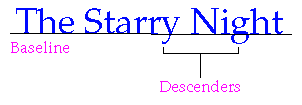
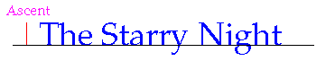
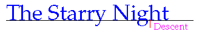
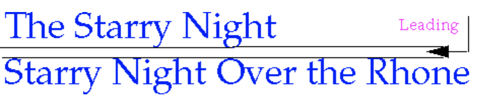
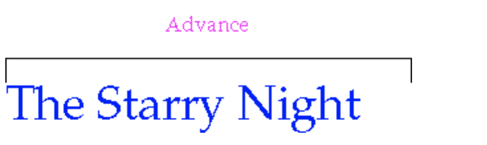
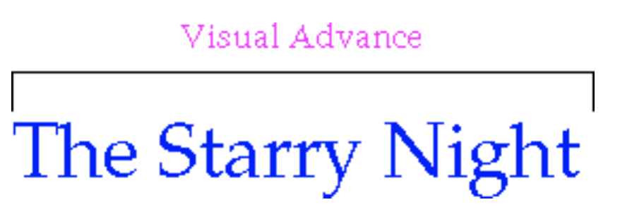
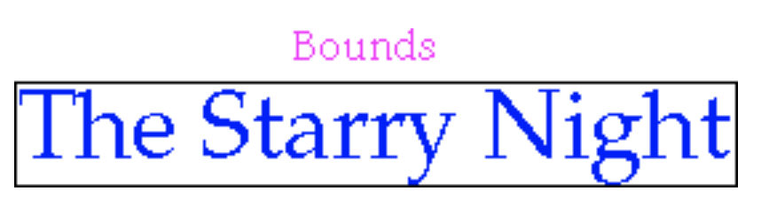
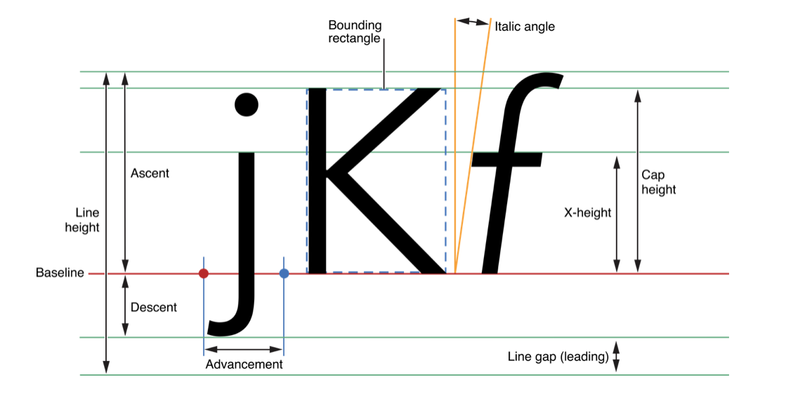
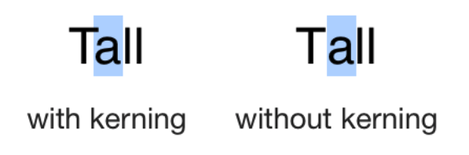

#### 文字相关的一些概念 

<!-- http://pawlan.com/monica/articles/texttutorial/other.html -->

1. baseline (假想的线，字符放在这些线上，一些字符比如y , g 会延伸到这些线下面) 	  
	baseline table   
	[baseline table](https://developer.apple.com/fonts/TrueType-Reference-Manual/RM06/Chap6bsln.html)
	
2. Ascent, Descent, and Leading -- 字体属性  
	2.1. Ascent 是最高字形 (glyph) 的顶部(top)到 baseline 的距离 
	  
	
	2.2. Descent 是 baseline 到最低下行字母(lowest descenders) 的底部的距离 
		 		  	2.3. leading 是最低下行字母的底部到下一行的顶部之间的距离 (多行设置生效的情况) 
		  
		
3. advance 文本布局的中字符串的宽度。最左边字形到最右边字形的距离  
		  	
	visual advance 
		  	
	bounds 
		  		
	
	一个综合例子
	
	  
	
	
	
4. Kerning 字距 所有的字符都有一个矩形的外边框。例如，现代文本布局会考虑到一个大写的“T”的“两翼”下面有一些空白，所以它会把后面的小写字母向左移让它们更靠近点	  
		  	
		
		
更多属性可以参考 
[NSAttributedString 属性介绍](https://github.com/zhangfangtaozft/NSAttributedString)

1. fontName、foregroundColor、backgroundColor
2. lineSpacing  行间距 (默认 0.0)
3. paragraphSpacing 段间距 （默认0.0）
4. firstLineHeadIndent 首行缩进
5. headIndent 整体缩进（除首行）
5. lineBreakMode 
6. minimumLineHeight
7. maximumLineHeight
8. addTabStop、removeTabStop 制表符
9. obliqueness
9. ...
