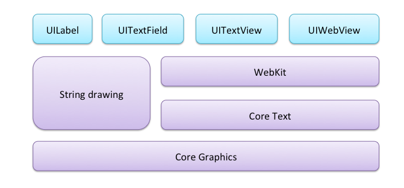
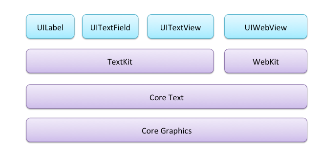
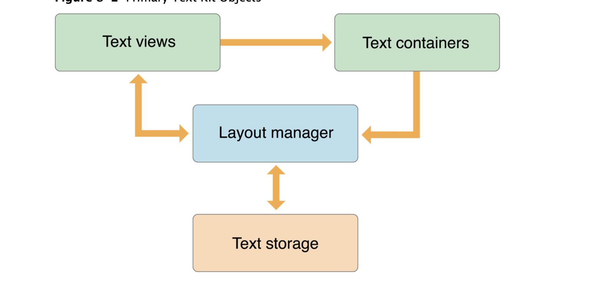
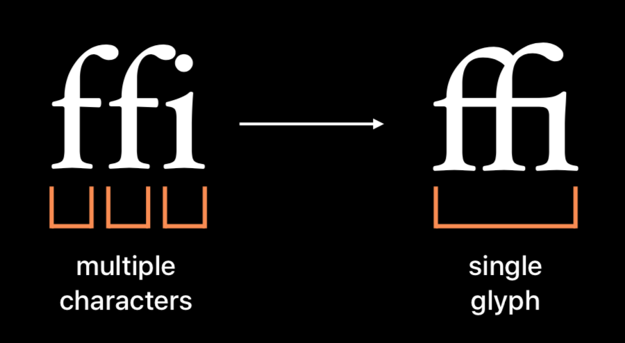
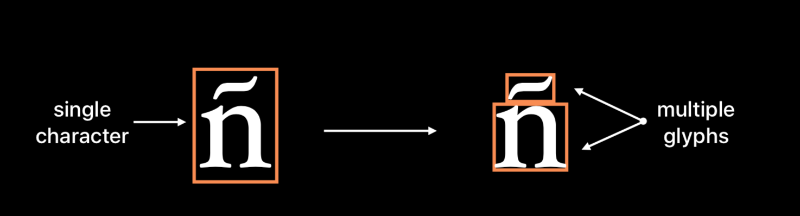
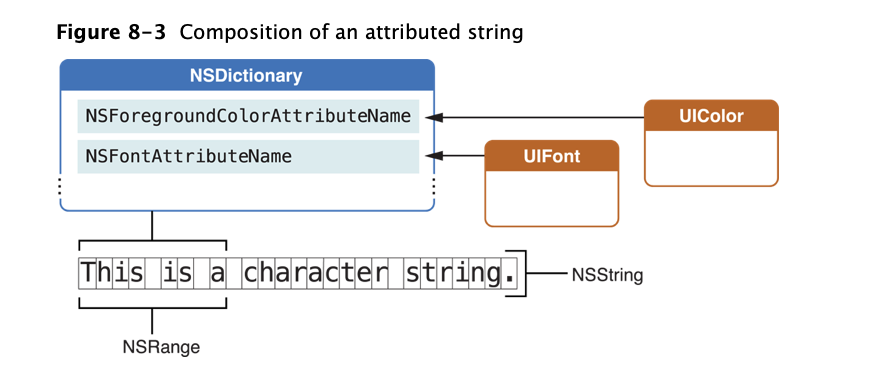
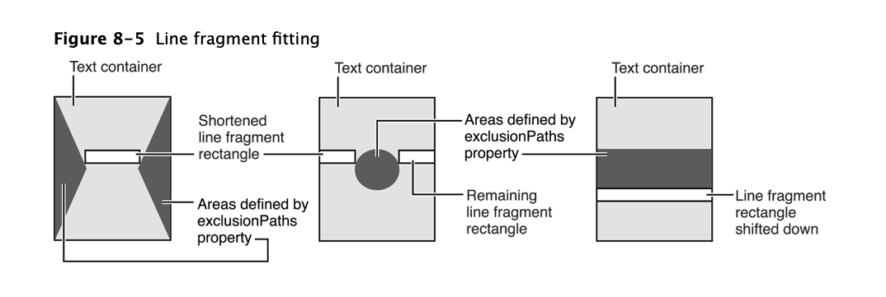
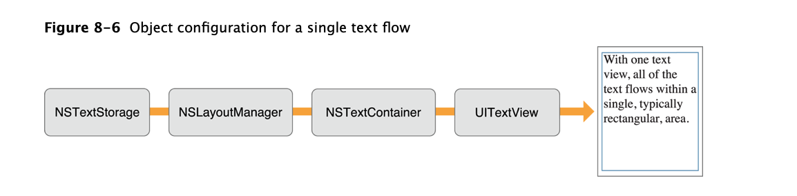
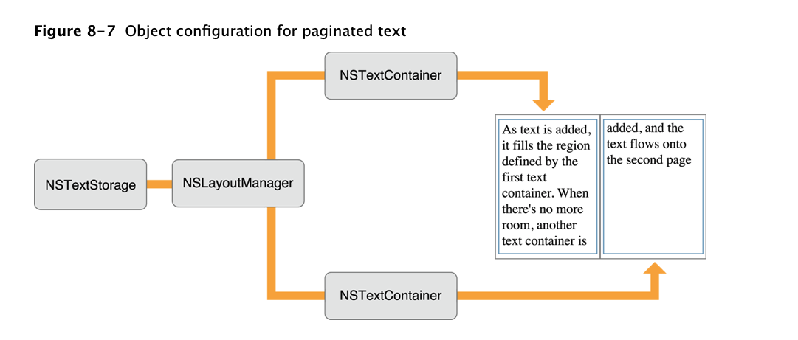
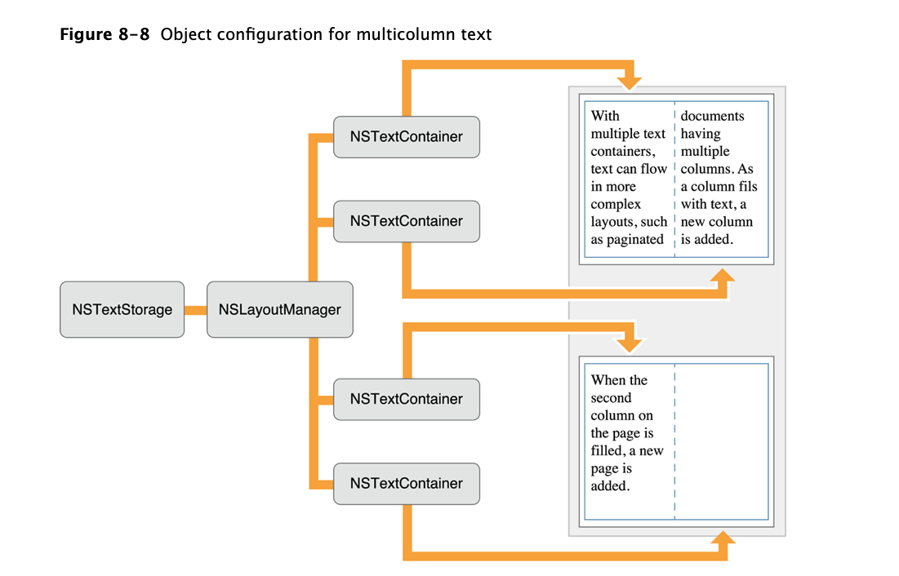

iOS 处理文本的方式在 iOS7 以后发生了改变。

iOS6 及以前， UIKit 中和文本相关的类，主要是用 Webkit 和 core  graphics 中的 string drawing 方法来实现绘制， 类的层级图如： 

可以看出 UITextView 是基于 webkit 实现的。 

iOS7 扁平化设计后， 类的层级结构发生了一些变化：

textkit 主要有三个类:

1. NSTextStorage 实际上是 NSMutableAttributedString 的子类。 持有 NSLayoutManager 数组，主要目的是在底层数据发生变化后，通知 layoutmanager 来进行布局变化。
2. NSLayoutManager 负责在一个或者多个 NSTextContainer 对象中进行渲染内容（NSTextStorage）。 把unicode字符转化成字形然后渲染到屏幕上。  
	「 字形： glyph    
	字符： character 」    
	字形和字符不是一对一的关系：
		 		 	
3. NSTextContainer 定义文本渲染的区域。可以使用 UIBezierPath 对象，定义排除的区域。

类比 MVC ，三个类的位置如：

`NLayoutManager`, `NSTextStorage`,`NSTextContainer ` 可以在子线程中访问， app 需要保证在同一个线程中访问。

#### 文本属性(text storage)

1. 字符（属性）

attributestring 属性对应一个字典对象，key 是 attribute name，例如 NSFontAttributeName。
可以通过 ` attributesAtIndex:effectiveRange:` 方法获取到对应range 的 attribute string的attribute values。
2. 段落（属性）
	目前主要用到段落间距. 使用 NSMutableParagraphStyle 对象的 paragraphSpacing 属性进行配置。主要是用 
	`- (void)addAttribute:(NSAttributedStringKey)name value:(id)value range:(NSRange)range;` 方法进行设置。
3. 文档（属性）
	可以设置 纸张尺寸、页边距、缩放比等
	
####  文本布局过程 （layout manager）
layout manager 分两步对文本进行布局

1. 生成字形 （glyph generation）
2. 布局字形 （glyph layout）

layout manager 职责：   
1. 控制 text storage 、text container 对象   
2. 根据字符生成字形   
3. 计算字形位置     
4. 管理字形、字符的范围     
5. 向textview绘制字形     
6. 控制断字（Controls hyphenation）     
7. 操控字符属性（character attributes）和字形属性（glyph properties）

####  text container(NSTextContainer)

1. 指定排除路线  

`@property (copy, NS_NONATOMIC_IOSONLY) NSArray<UIBezierPath *> *exclusionPaths`
2. 指定多列多页布局     

一般用法：

<pre><code>NSTextStorage* textStorage = [[NSTextStorage alloc] initWithString:string];
NSLayoutManager *layoutManager = [[NSLayoutManager alloc] init];
[textStorage addLayoutManager:layoutManager];
self.textContainer = [[NSTextContainer alloc] initWithSize:self.view.bounds.size];
[layoutManager addTextContainer:self.textContainer];
UITextView* textView = [[UITextView alloc] initWithFrame:self.view.bounds 
textContainer:self.textContainer];
[self.view addSubview:textView];
</code></pre>

分页效果

多页多列

也可以选用多个 layout manager 来实现需求

参考 Demo   
1.  [https://github.com/thierryxing/swift-textkit-demo](https://github.com/thierryxing/swift-textkit-demo)   
2. [https://github.com/objcio/issue-5-textkit](https://github.com/objcio/issue-5-textkit)

参考资料

1. 
[https://developer.apple.com/library/archive/documentation/StringsTextFonts/Conceptual/TextAndWebiPhoneOS/CustomTextProcessing/CustomTextProcessing.html](https://developer.apple.com/library/archive/documentation/StringsTextFonts/Conceptual/TextAndWebiPhoneOS/CustomTextProcessing/CustomTextProcessing.html)
2. 
[https://objccn.io/issue-5-1/](https://objccn.io/issue-5-1/)
3. [TextKit Best Practices](https://developer.apple.com/videos/play/wwdc2018/221/)